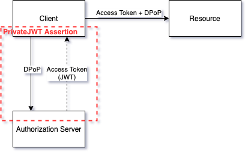
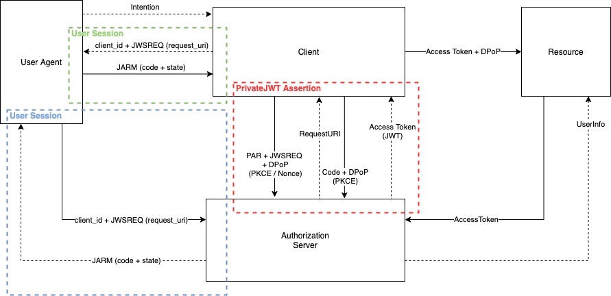

# SolID

## Glossary

* `Token` - identity, authorization, and authenticity is held by the value of
  the token (Anonymous subway ticket);
* `Sender-constrained token` - identity and authorization is held by the token,
  but authenticity is held by a third-party secret (Named flight ticket + ID Card);
* `DPoP` - Demonstration of Proof of Possession mechanism used to proof the
  knowledge of the third party secret without revealing it for
  `sender-constrained token`;
* `PKCE` - Proof Key for Code Exchange mechanism used to protect from
  `authorization code` interception;
* `PAR` - Pushed Authorization Request is a mechanism used by the `client` has to
  create the initial `authorization request` in place of the `user agent`, this
  reduce drastically the threats generated by the authorization request user
  modifications;
* `JWSREQ` - a mechanism where the request parameters are encoded using JWS
  standard, so that parameter integrity and optionnaly confidentiality are
  protected;
* `JARM` - JWT Authorization Response Mode is a mechanism where the
  `authorization_code` flow response is encoded using JWS Standard, so that
  parameter integrity and optionnaly confidentiality are protected;

## Grant flows

### Client Credentials

> Service account access.

Authentication:

* Client authentication is done using `private_jwt` authentication method;

Standard Changes:

* `DPoP` is required for all client type (confidential, public);
* `access token` is a `sender-constrained token` linked to `DPoP` proof;

### Authorization Code

> Online user access.

Authentication:

* Client authentication is done using `private_jwt` authentication method;

Standard changes:

* `PKCE+Nonce` is required for all client type (confidential, public);
* Initial intent makes the `client` to create the `authorization request` using
  `PAR` to prevent request manipulation from the user. `User Agent` will be
  redirected to `authorization_endpoint` using an URL with `JWSREQ` object with
  the `request_uri` that references the `authorization request` created by the
  client;
* All requests and responses use `JWSREQ` and `JARM` to protect request and
  response integrity;
* `access token` is a `sender-constrained token` linked to `DPoP` proof to
  prevent access token usage from alternative client;
* No `id_token` will be emitted, `user_info` endpoint must be used to retrieve
  user details that the user consents to share at the service consultation time;
* `access_token` contains an anonymized form of the user identity reference which
  is related to `pairwise subject identifier`.

Future investigations:

* `DPoP + Authorization Code` to limit authorization code to client usage only (JWSREQ Binding ?);
* `DPoP + PAR` to limit authorization request_uri to client usage only (JWSREQ Binding ?);

### Device Code

> IoT / Constrained environment access.

### Refresh Token

> Offline user access, act as user without online participation.
