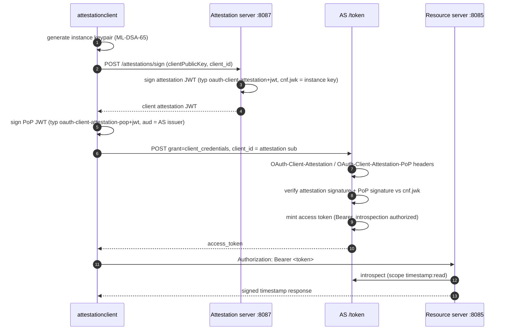

# Attestation Client (client attestation JWT authentication)

Demonstrates the client-attestation authentication chain
(draft-ietf-oauth-attestation-based-client-auth-11): a fresh post-quantum
client instance key is generated, attested by the attestation server, proven
live via a signed proof-of-possession, and both are presented at the token
endpoint.

Prerequisites: `authorizationserver`, `attestationserver` and
`resourceserver` running (see [`../README.md`](../README.md)).

## Flow

## What it proves

* Client identity derives from an attested key, not a registration secret:
  the instance key never leaves the client, only its attestation and
  short-lived proofs do.
* The AS verifies the full chain: attestation signature (attestation-server
  key set) → embedded `cnf.jwk` → PoP signature over the same key.
* The attestation JWT (`typ: oauth-client-attestation+jwt`) and the PoP JWT
  (`typ: oauth-client-attestation-pop+jwt`) ride the
  `OAuth-Client-Attestation` / `OAuth-Client-Attestation-PoP` headers
  (draft-ietf-oauth-attestation-based-client-auth-11, sections 4 and 5.1).

