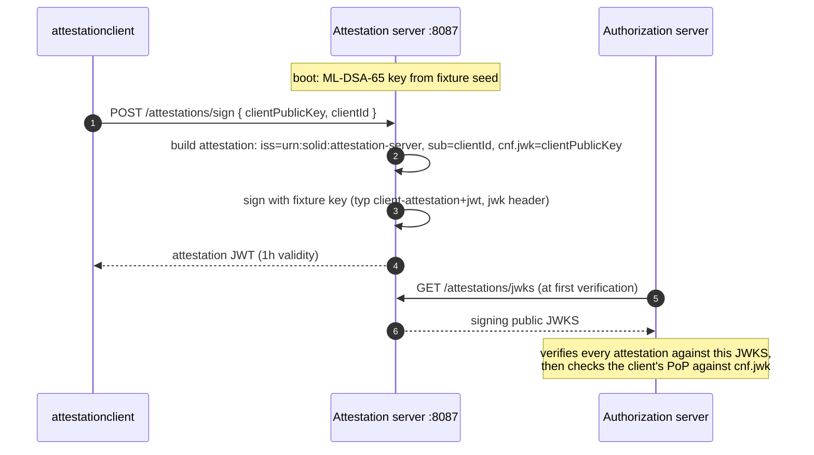

# Attestation Server

Issues client attestation JWTs for the attestation-based client
authentication demo. It signs with a fixed fixture seed so the
authorization server (which pins the corresponding public key in its static
client registry) can verify attestations across processes.

Prerequisite of `attestationclient`; see [`../README.md`](../README.md).

## Flow

## What it proves

* The attestation is a bearer-bindable credential for exactly one client
  public key (`cnf.jwk` echoes the request's key verbatim).
* The signing key is out-of-band pinned: the AS registry fixture
  (`urn:solid:attestation-server` client entry) trusts the JWKS published
  at `/attestations/jwks`.
* A real deployment would derive this key from secure hardware and
  authenticate requesting clients; the example keeps it deliberately
  minimal.
