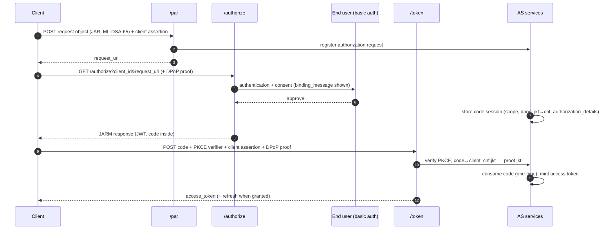
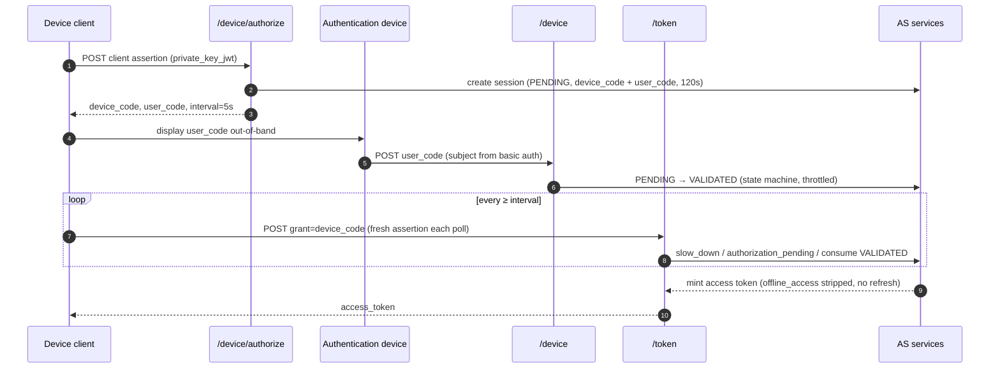
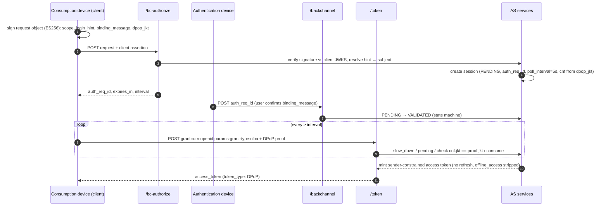

# Authorization Server (example assembly)

Reference assembly of the `solid` SDK as an OAuth 2.1 / OIDC authorization
server. It wires the strict profile (`server/profile`): PAR + JAR + DPoP +
JARM for the authorization-code flow, elliptic-curve and post-quantum
signing only, asymmetric client authentication only, pairwise subjects,
and the device and CIBA grants with their cross-device hardening.

Run it with `go run ./examples/authorizationserver` (see
[`../README.md`](../README.md) for the full demo ecosystem).

## Endpoints

| Route | Purpose |
|---|---|
| `/.well-known/oauth-authorization-server` | AS metadata (RFC 8414) |
| `/.well-known/openid-configuration` | OIDC discovery |
| `/keys` | AS signing JWKS |
| `/spiffe/bundle.json` | example.org trust-domain bundle |
| `/par` | Pushed Authorization Requests (RFC 9126) |
| `/authorize` | authorization endpoint (JAR + JARM) |
| `/token` | token endpoint (all grants) |
| `/token/introspect` · `/token/revoke` | RFC 7662 / RFC 7009 |
| `/device/authorize` · `/device` | RFC 8628 device flow |
| `/bc-authorize` · `/backchannel` | OpenID CIBA (poll mode) |

## Authorization-code flow (PAR + JAR + DPoP + JARM)

The strict profile's front channel: the request is pushed as a signed
request object, the end user authenticates (basic auth, subject becomes the
pairwise subject), the response is JWT-encoded (JARM) and the issued code
carries a DPoP key binding.

## Device flow (RFC 8628)

## CIBA flow (OpenID CIBA Core 1.0, poll mode)

## Notes

* Key material: ephemeral ML-DSA-65 signing key and ephemeral P-256
  encryption key at boot unless `SOLID_EXAMPLE_SIGNING_KEY` /
  `SOLID_EXAMPLE_ENCRYPTION_KEY` are set (see [`../README.md`](../README.md)).
* Access and refresh tokens are HPKE-encrypted JWTs (`HPKE-7`,
  draft-ietf-jose-hpke-encrypt-22): sign-then-encrypt, 5-segment JWE
  compact serializations.
* Storage is in-memory: all state is lost on restart.
* The deny paths of the device and CIBA validation services stay
  service-level (exercised by `integration/` tests); the HTML endpoints
  expose approval only.
