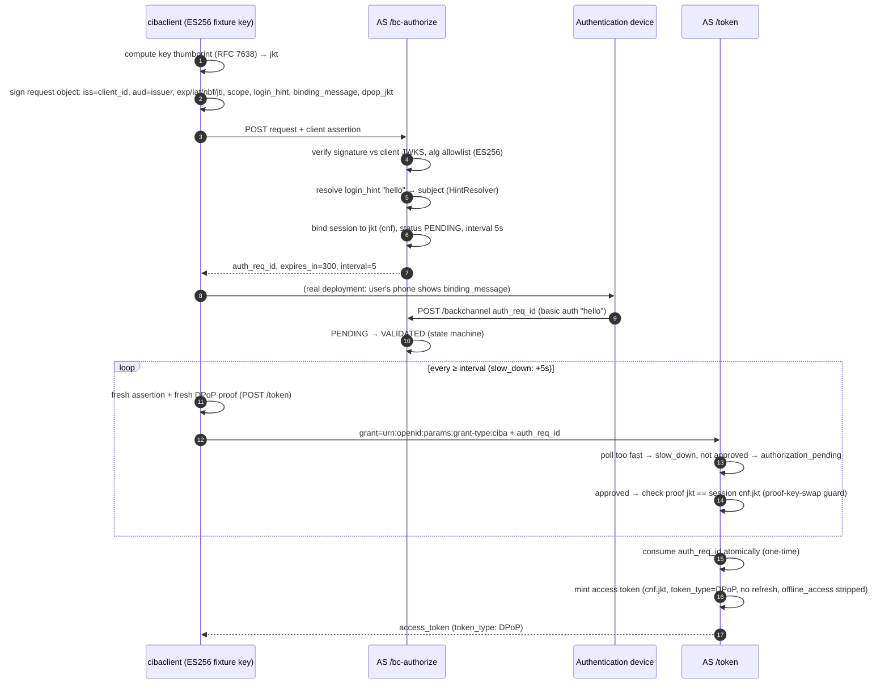

# CIBA Client (poll mode, DPoP-bound)

Drives the full OpenID CIBA Core 1.0 round trip in poll mode with a signed
request object and a DPoP key binding:

* client authentication with `private_key_jwt` (ES256, fresh assertion per
  request — each `jti` is single-use),
* all authentication request parameters — including the DPoP key
  thumbprint `dpop_jkt` — carried inside the signed request object
  (CIBA §7.1.1),
* end-user approval on the authentication device (the AS `/backchannel`
  endpoint standing in for the user's phone),
* token-endpoint polling with a fresh DPoP proof of the bound key per poll.

Prerequisite: `authorizationserver` running (see [`../README.md`](../README.md)).

## Flow

## What it proves

* The solid promotion: `binding_message` is required (the CD/AD
  anti-phishing interlock) and charset-constrained.
* Signed request objects are verified against the client's registered
  JWKS with an EC-only algorithm allowlist; parameters may not appear
  outside the JWT.
* The optional DPoP binding (RFC 9449 §10 analog): polls without a proof or
  with the wrong key are rejected `invalid_grant` **before** the session is
  consumed — a retry with the right key still succeeds.
* The CIBA grant never mints refresh tokens and strips `offline_access`
  (RFC 9700 §4.12.2).
