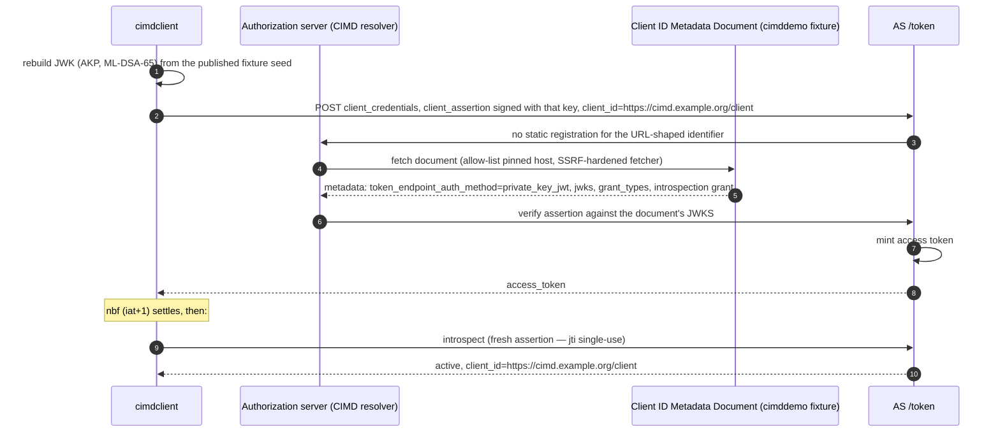

# CIMD Client (Client ID Metadata Document)

Demonstrates client authentication with a URL-shaped client identifier
resolved through its Client ID Metadata Document
(draft-ietf-oauth-client-id-metadata-document): the AS resolves
`https://cimd.example.org/client` to the demo fixture document at
authentication time — no static registration exists.

Prerequisite: `authorizationserver` running (see [`../README.md`](../README.md)).

## Flow

## What it proves

* Client registration moves to the document: the AS trust decision is
  reduced to a host allow-list (operator-pinned, never caller-controlled)
  and the SSRF-hardened fetch.
* The document's grants flow through: the introspection call succeeds
  because the *document* declares `authorized_introspection_clients`.
* Assertions stay single-use (`jti` burned per request), so the demo mints
  a fresh one before introspecting.
