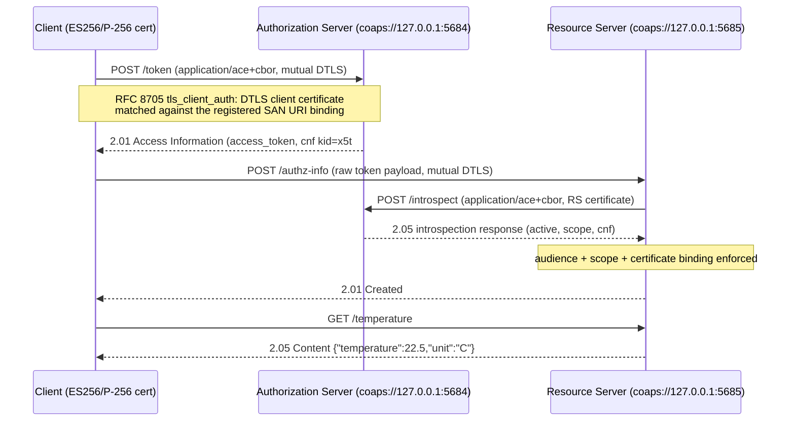

# CoAP ACE-OAuth Example (RFC 9200)

This example demonstrates OAuth 2.0 over CoAP per **RFC 9200** (Authentication and
Authorization for Constrained Environments, ACE-OAuth), using mutual **DTLS 1.2** as the
transport security layer (the `coap_dtls` profile, RFC 9202). The full triangle runs
in one process:



## What it demonstrates

| Step | Mechanism | RFC |
|---|---|---|
| Token request over CoAP | `application/ace+cbor` CBOR codec (`sdk/ace`), grant `client_credentials` | RFC 9200 §5.8.1 |
| Access Information response | abbreviated keys, `token_type=PoP`, `ace_profile=coap_dtls` | RFC 9200 §5.8.2, RFC 9202 §9 |
| mTLS client authentication | DTLS client cert → `clientauthentication.TLSClientAuth` (SAN URI binding) | RFC 8705 §2.1 |
| Certificate-bound tokens | `x5t#S256` confirmation minted at the AS, enforced at the RS | RFC 8705 §3.1 |
| Introspection over CoAP | Table 6 CBOR payload, RS authorized via `AuthorizedIntrospectionClients` | RFC 9200 §5.9, RFC 7662 §2.1 |
| authz-info | raw token POST, one token per PoP key | RFC 9200 §5.10.1 |
| AS Request Creation Hints | 4.01 payload directing unauthorized clients to the AS | RFC 9200 §5.3 |
| Error responses | abbreviated error codes (Table 3) | RFC 9200 §5.8.3 |

The wire codec lives in `sdk/ace` (transport-free, reusable for any presentation layer);
the AS reuses the presentation-agnostic token and introspection services from
`server/services` with **zero protocol changes**. There is deliberately **no DPoP on the
CoAP side**: the token binding is mTLS certificate-based (RFC 8705 via DTLS), matching
the `coap_dtls` profile direction of RFC 9202.

## Run

```sh
go run ./examples/coapace        # full triangle, in-process
go test ./examples/coapace/     # behavior test incl. negative paths
```

Split mode (`as`, `rs`, `client` subcommands) exists but is **not runnable**: the demo
PKI and the registered client identifiers are ephemeral per boot (generated with
`crypto/rand`, ES256 on P-256), so processes started separately cannot share the trust
anchors or registrations. The all-in-one demo is the runnable path.

## Security notes

- **Ephemeral keys**: the CA, the AS/RS/client leaf certificates, the storage keys and
  the client registrations are generated at each boot and never persisted. Nothing in
  this example is a production PKI.
- **ES256 / P-256 only** (client certificates and all signing) — the repo algorithm
  posture (no RSA/HSxxx).
- **DTLS 1.2** (pion/dtls v3): `RequireAndVerifyClientCert`,
  `RequireExtendedMasterSecret`; both peers verify against the demo CA pool.
- **Loopback only**: AS `coaps://127.0.0.1:5684` (standard coaps port), RS
  `coaps://127.0.0.1:5685`.
- **One token per PoP key** at the RS (RFC 9200 §5.10.1): a new `/authz-info` upload
  for the same certificate supersedes the previous token.
- **cnf `kid`**: the token response and introspection `cnf` carry the binding key
  reference (`x5t#S256` thumbprint bytes, RFC 8747 §3.4.1 key-reference form). The
  authoritative binding is the token itself; introspection conveys the same reference
  to the RS.
- **Inactivity monitor**: go-coap closes idle DTLS connections after ~16 s; the demo
  completes in well under a second.
