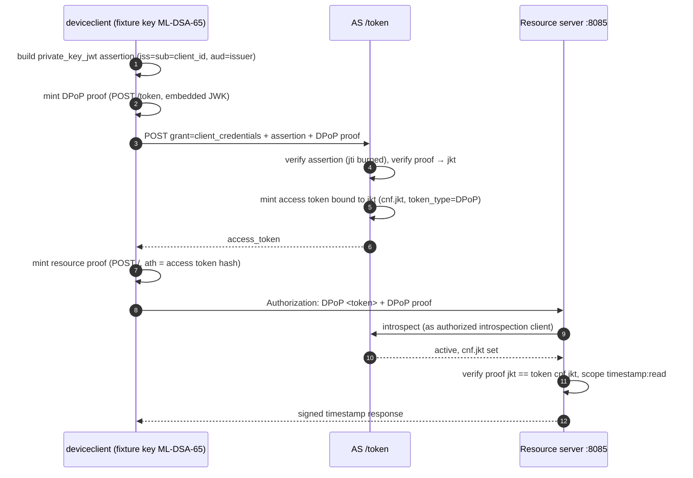

# Device Client (DPoP-bound client_credentials)

Despite the name inherited from the device ecosystem, this demo exercises a
`client_credentials` grant whose access tokens must be DPoP-bound
(`DpopBoundAccessTokens` on the fixture client), then calls the timestamp
resource with a fresh proof carrying the token value.

Prerequisite: `authorizationserver` and `resourceserver` running
(see [`../README.md`](../README.md)).

## Flow

## What it proves

* Client authentication is asymmetric only (`private_key_jwt`,
  ML-DSA-65): no secrets over the wire.
* DPoP sender-constrains both the minted token (proof at the token
  endpoint) and its use (fresh proof with `ath` at the resource).
* The resource server refuses bearer use of a DPoP-bound token
  (`cnf.jkt` set → proof required).
