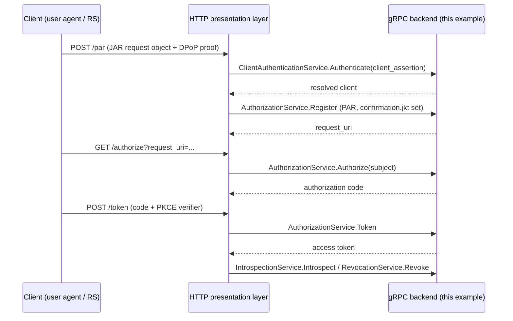

# gRPC backend server

This example assembles the solid SDK as a **standalone gRPC authorization
backend**: the protocol core (client authentication, PAR, authorization,
token issuance, introspection, revocation, dynamic client registration) runs
behind the proto-defined gRPC services, and a presentation layer (HTTP
today, CoAP or gRPC-native tomorrow) talks to it over gRPC.

This is the reference assembly for the project's core idea — decoupling
the OAuth protocol from HTTP — see `server/grpckit` for the adapters.

## Architecture



The presentation layer owns all HTTP-bound mechanics: it decodes the JAR
request object, verifies the DPoP proof (htm/htu are HTTP-bound) and
extracts the mutual-TLS client certificate, then forwards the resolved
values (`request`, `confirmation.jkt`, `tls_client_cert`,
`token_confirmation`) through the proto fields. The backend enforces the
semantics.

## Run

```sh
go run ./examples/grpcbackend
```

The server listens on gRPC `:9090` and exposes:

| Service | RPCs |
|---|---|
| `oidc.flow.v1.AuthorizationService` | `Authorize`, `Register` (PAR), `Token` |
| `oidc.client.v1.ClientAuthenticationService` | `Authenticate` |
| `oidc.client.v1.ClientRegistrationService` | `Register` (RFC 7591, gated) |
| `oidc.client.v1.ClientRegistrationManagementService` | `Read`, `Update`, `Delete` (RFC 7592, same gate) |
| `oidc.token.v1.IntrospectionService` | `Introspect` |
| `oidc.token.v1.RevocotonService` | `Revoke` |

Protocol errors ride the response payload (`res.error`), not the gRPC
status, so the presentation layer can map them to RFC-compliant HTTP
responses.

### Environment variables

| Variable | Default | Description |
|---|---|---|
| `SOLID_EXAMPLE_GRPC_LISTEN_ADDR` | `:9090` | gRPC listen address (private surface) |
| `SOLID_EXAMPLE_ISSUER` | `http://127.0.0.1:8080` | public AS issuer of the presentation layer in front of the backend |
| `SOLID_EXAMPLE_DCR_ENABLED` | `false` | enable RFC 7591 dynamic client registration (deny by default) |

RFC 7592 management (`ClientRegistrationManagementService`: Read, Update,
Delete) rides the same `SOLID_EXAMPLE_DCR_ENABLED` gate as registration:
when registration is disabled, no registration access tokens are issued,
so management calls fail closed with `invalid_token`. Updates are full
replacements re-validated with the RFC 7591 rules; deleting a client
revokes every token issued to it.

## Limitations

The device grant and CIBA backends have no proto RPCs yet, so those flows
are not reachable through this gRPC surface (the session stores are wired
because the token service requires them).
