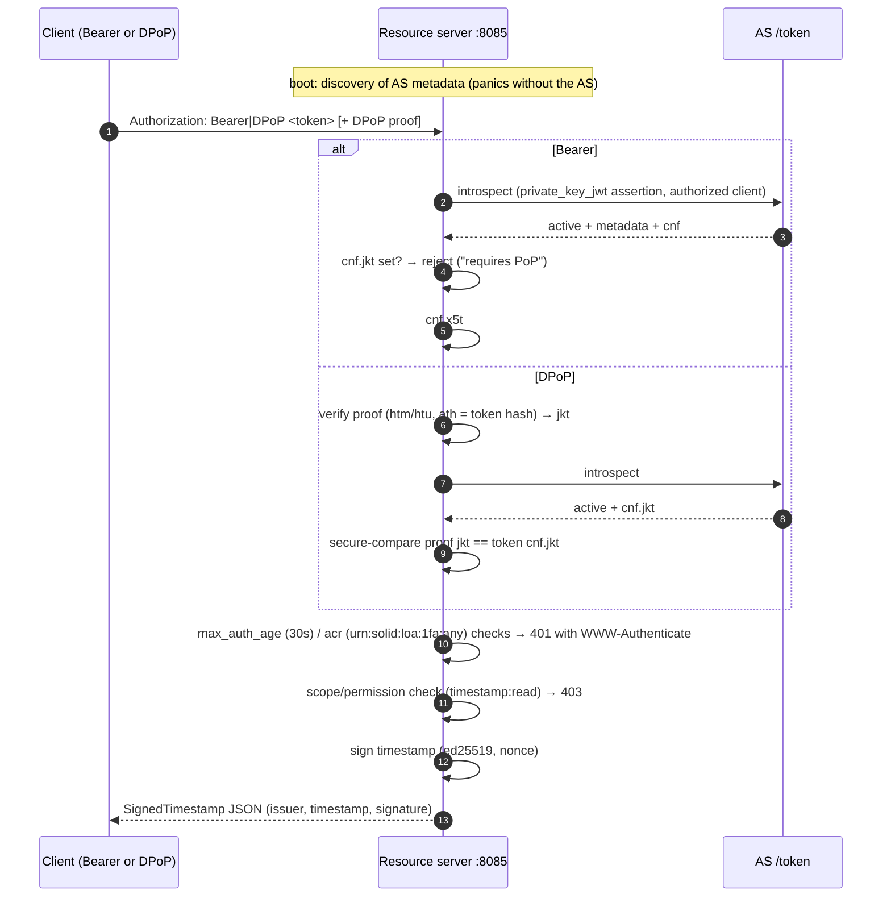

# Resource Server (signed timestamp)

Protected resource serving a signed timestamp. It is a reference consumer
of the solid stack: discovery of the AS, token introspection under the
`authorized_introspection_clients` grant, Bearer and DPoP access, RFC 8705
certificate binding, and RFC 9470 step-up signals (`max_age`, `acr`).

Prerequisites: `authorizationserver` running (see [`../README.md`](../README.md)).

## Endpoints

* `/.well-known/oauth-protected-resource` — PRM (RFC 9728)
* `/` — the signed-timestamp resource (scope `timestamp:read`)

## Flow

## What it proves

* A resource server can authorize on both proof schemes with the same
  middleware (`Bearer` and `DPoP` schemes dispatched on the
  `Authorization` prefix).
* Sender-constrained tokens are enforced, not just introspected: a
  DPoP-bound token fails Bearer access; a certificate-bound token fails
  without the bound mTLS certificate.
* Step-up authentication challenges carry the RFC 9470 fields
  (`max_age`, `acr_values`) and RFC 9728 discovery pointers
  (`resource`, `resource_metadata`).
