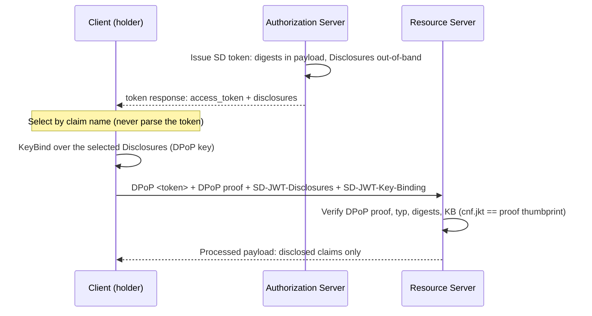

# Selectively Disclosable Tokens (`examples/sdtoken`)

Reference assembly of **draft-forten-oauth-sd-jwt-access-token-00** —
"Selective Disclosure for JWT Access Tokens Without Changing the Token" —
plus the SDK-level **ID-token generalization** of the same profile, over both
serializations (JWT per the draft, CWT as the format-agnostic analog).

## What it demonstrates

- **Access tokens whose non-protocol claims are selectively disclosable**
  (RFC 9901 semantics): the token keeps its ordinary `typ` (`at+jwt`, or
  `application/at+cwt` on the CWT side) and carries only digests (`_sd` +
  `_sd_alg`, or `redacted_claim_keys` + `sd_alg`); the Disclosures travel in
  the token response `disclosures` parameter.
- **Per-request presentation**: the client selects Disclosures by claim name
  (it never parses the token — draft §4) and sends them in the
  `SD-JWT-Disclosures` HTTP field (RFC 9651 Structured Fields List of
  Strings), with the key-binding JWT in `SD-JWT-Key-Binding`.
- **DPoP-bound key binding**: the KB is signed by the client's DPoP proof
  key; the verifier enforces the draft §5.3 thumbprint equality
  (`cnf.jkt` == SHA-256 thumbprint of the proof key).
- **SD ID tokens** (the generalization): OIDC-core claims protected, user
  claims (`email`, `name`) disclosable, verified by the client with the
  `id_token` profile (`typ` `id+jwt` / `application/id+cwt`). Example-level
  direct mint — no AS grant handler mints ID tokens (the repo keeps the
  "no id_token in the authorization code flow" posture).
- **Both serializations** through one profile factory: `--format=cwt` runs
  the identical flow over the CWT kind.



## Running

```sh
go run ./examples/sdtoken            # JWT serialization (the draft form)
go run ./examples/sdtoken --format=cwt
```

The run prints the RS-verified processed payload (disclosed `email`,
withheld `name`), the verified SD ID token claims, and the raw token
payload showing digests and no cleartext user claims — the smoke test of
the mechanism.

## Where the pieces live

|Piece|Location|
|---|---|
|Profile contracts, kind factory, structured fields|`sdk/sdtoken`|
|JWT adapter (draft-forten serialization)|`sdk/sdtoken/sdjwt`|
|CWT adapter (SD-CWT shape)|`sdk/sdtoken/sdcwt`|
|Token generators (mutation-and-persist of `tokenv1.Token`)|`sdk/token/sd`|
|Token response `disclosures` parameter|`server/httpkit`|
|Vendored draft|`docs/rfcs/draft-forten-oauth-sd-jwt-access-token-00.txt`|
