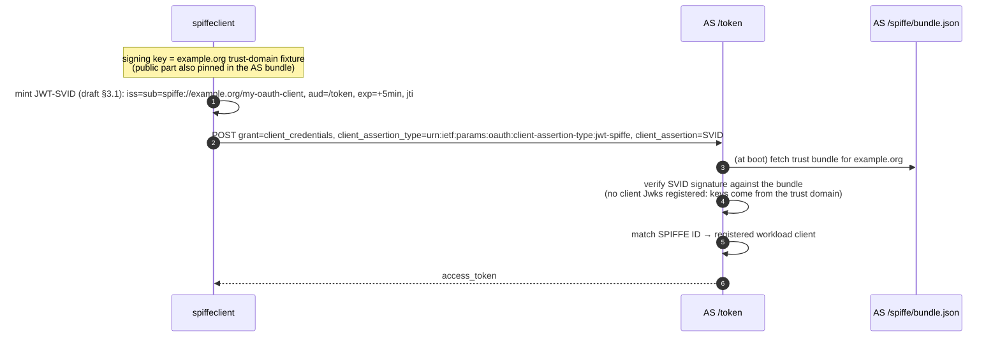

# SPIFFE Client (JWT-SVID client authentication)

Demonstrates OAuth SPIFFE client authentication
(draft-ietf-oauth-spiffe-client-auth-02): the client mints a JWT-SVID for
the registered workload `spiffe://example.org/my-oauth-client` with the
example.org trust-domain fixture key and exchanges it at the token endpoint
with the `jwt-spiffe` client assertion type.

Prerequisite: `authorizationserver` running (see [`../README.md`](../README.md)).

## Flow

## What it proves

* Client identity is the workload identity: no per-client key registration
  on the AS — verification delegates to the trust-domain bundle
  (`spiffe.BundleSource`), proving the SDK's decoupling of client
  authentication from static key registries.
* The SVID is short-lived and single-purpose (`aud` = token endpoint), so a
  leaked SVID is useless elsewhere.
